Text2Image System Investigation
==============================

This report is based on the two notebooks available in the `notebooks` directory.

## Data Exploration
Let's examine the dataset:
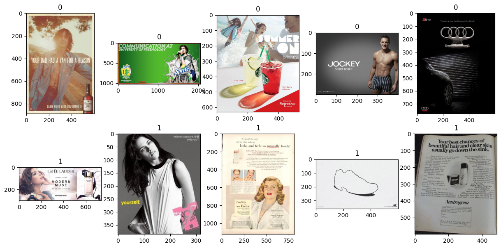
The dataset consists of two folders: 0 and 1, with similar images across both folders. We can conclude:
- **The dataset comprises images of varying sizes.**
- **Some images contain a substantial amount of text, while others have only a few words.**
- **The dataset likely consists of advertising images with text, or something similar.**

## Model Evaluation
Our task is to find similar images based on textual queries. Assuming we have a model that can do this, the question becomes how to evaluate the model's performance. Ideally, we would have a dataset where, given a textual query, we know the relevant image. However, such a dataset is not available, so we must create one ourselves. I propose several methods for this.

### 1. Using ImageNet models
Since the dataset consists of advertisement items, we can use ImageNet models for classification. The ImageNet dataset has classes similar to those in our dataset. Let's assume the class of an image is correct if the model's confidence in this class is greater than 0.85. Based on this [leaderboard](https://paperswithcode.com/sota/image-classification-on-imagenet), I chose the `efficientnet_b4_ns` model. Using this approach, we created a dataset of 218 text2image pairs with 66 unique texts. Here are some examples:
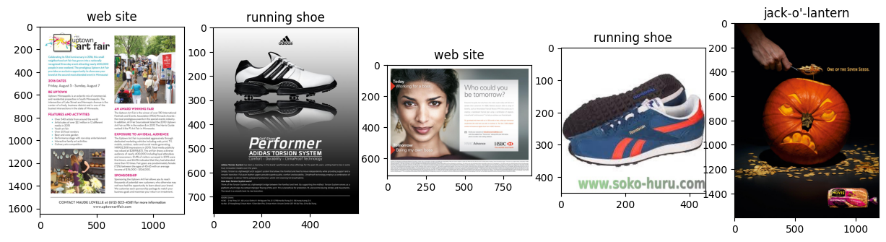
We conclude:
**Pretrained ImageNet models can label images. However, there are sets of images, rather than single images, relevant to each specific class.**

### 2. Using image2text open-source models
Another method is using open-source image2text models. I chose the `nlpconnect/vit-gpt2-image-captioning` model from Hugging Face Hub. Here are some examples:
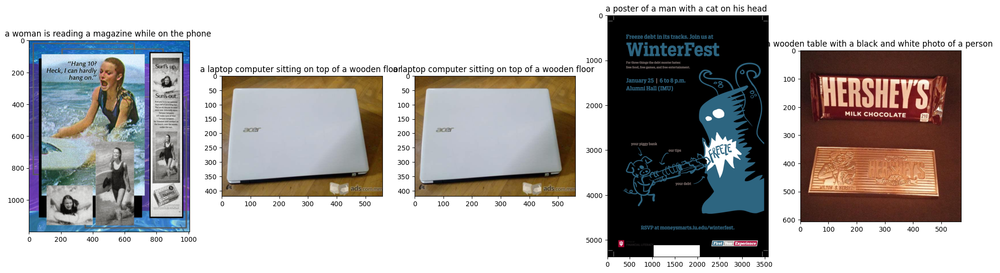
Unfortunately, **using small image-to-text models is not advisable, as they often produce inaccurate text.**

### 3. Using multimodal models from OpenAI
OpenAI recently released GPT-4, capable of generating text from images. I used the `gpt-4-vision-preview` model. Here are some examples:
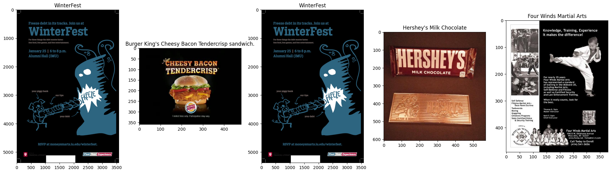
We conclude:
**OpenAI's multimodal model is effective for generating text from images. This approach is chosen due to the lack of sufficient local resources for running large models, while utilizing OpenAI's API is a viable paid alternative.**

### Metrics
To evaluate the model's performance, we need to define metrics. I propose the following:
- **HitRate@k**: We may want to receive a couple of relevant images for each query. Therefore, we should know how often the relevant image appears in the top k results.
- **Mean Reciprocal Rank (MRR)**: The previous metric does not account for the position of the relevant image in the results, nor does it specify the value of k.

## Text2Image model
For finding similar images based on textual queries, we can use CLIP models. These models can create vector representations of images and texts. Then, we can find similar images by calculating the cosine similarity between these vectors. Based on the [leaderboard](https://github.com/mlfoundations/open_clip/blob/main/docs/openclip_retrieval_results.csv), I chose the `ViT-B-16-SigLIP` model. Here are some examples:
1. Using ImageNet labels:
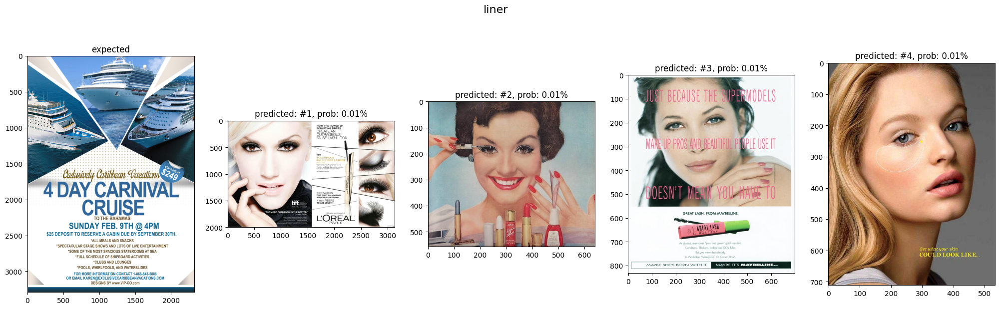
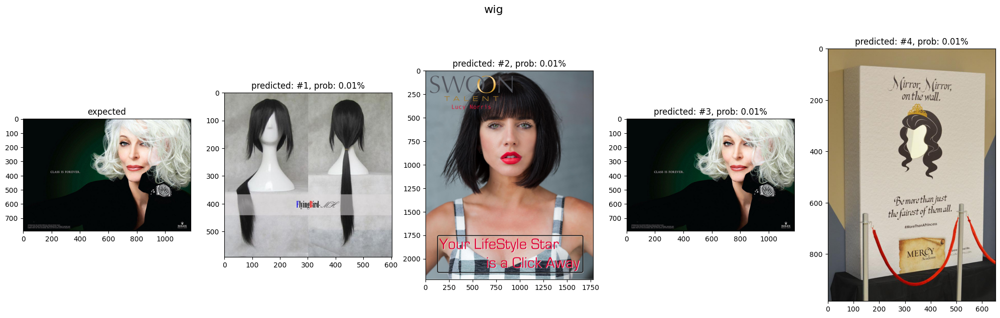
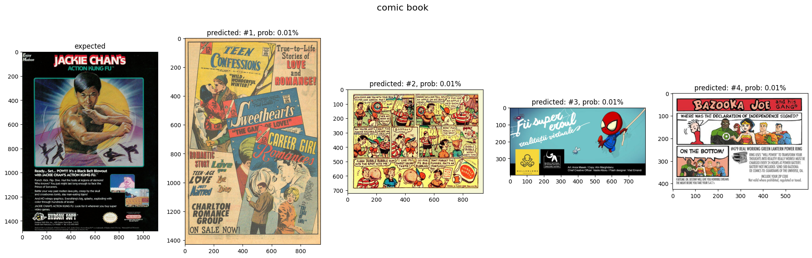
2. Using OpenAI labels:
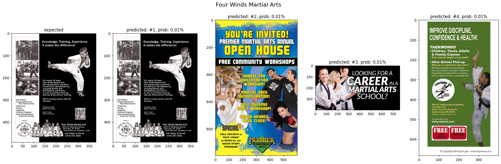
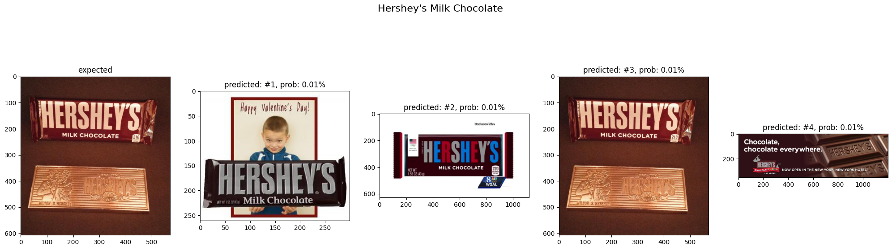
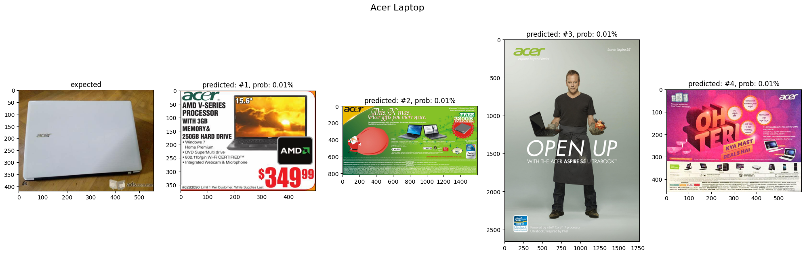

We can conclude:
- **Small OpenCLIP models are effective in retrieving relevant images from the dataset.**
- **Fine-tuning the OpenCLIP model is advisable, considering the minimal difference in probabilities between relevant and irrelevant images.**
- **The dataset generated using OpenAI's model is better than the one generated using ImageNet models.**

## Pipeline Evaluation
Now, let's evaluate the end-to-end pipeline using OpenAI's dataset and the defined metrics. Here are the results:
- **MRR: 0.64**
- **HitRate@5: 0.74**

It means that **on average the relevant image within the top 2-3 results**. Also, we can see that **in 74% of cases the relevant image is in the top 5 results**.
Let's have a look at some good examples, based on the RR metric:
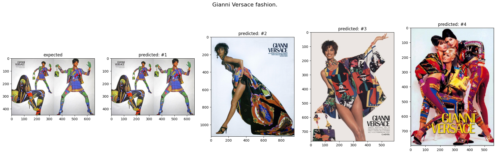

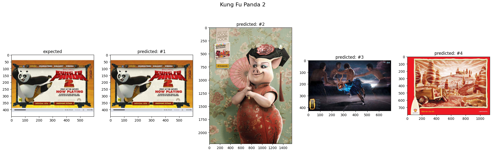

And some bad examples:
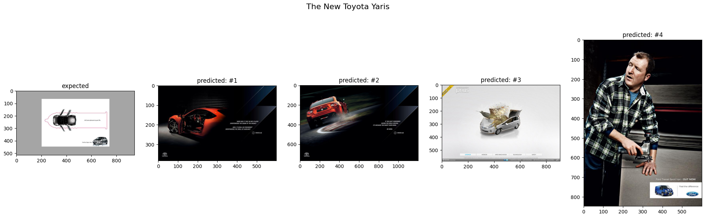
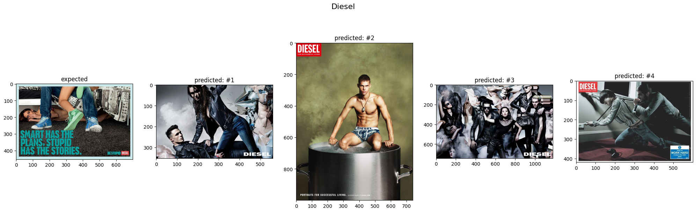
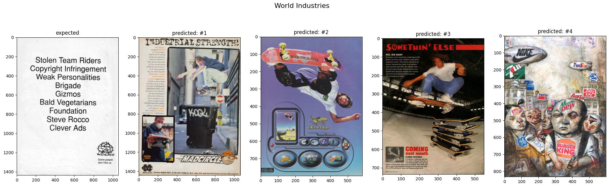

Here we can see that we have some problems with the labels. This is because the images are correct based on the input, from my point of view, however, the ground truth image wasn't retrieved.

## Next Steps
- **Create a more reliable dataset**
- **Fine-tune the OpenCLIP model**
- **Try larger OpenCLIP models**
